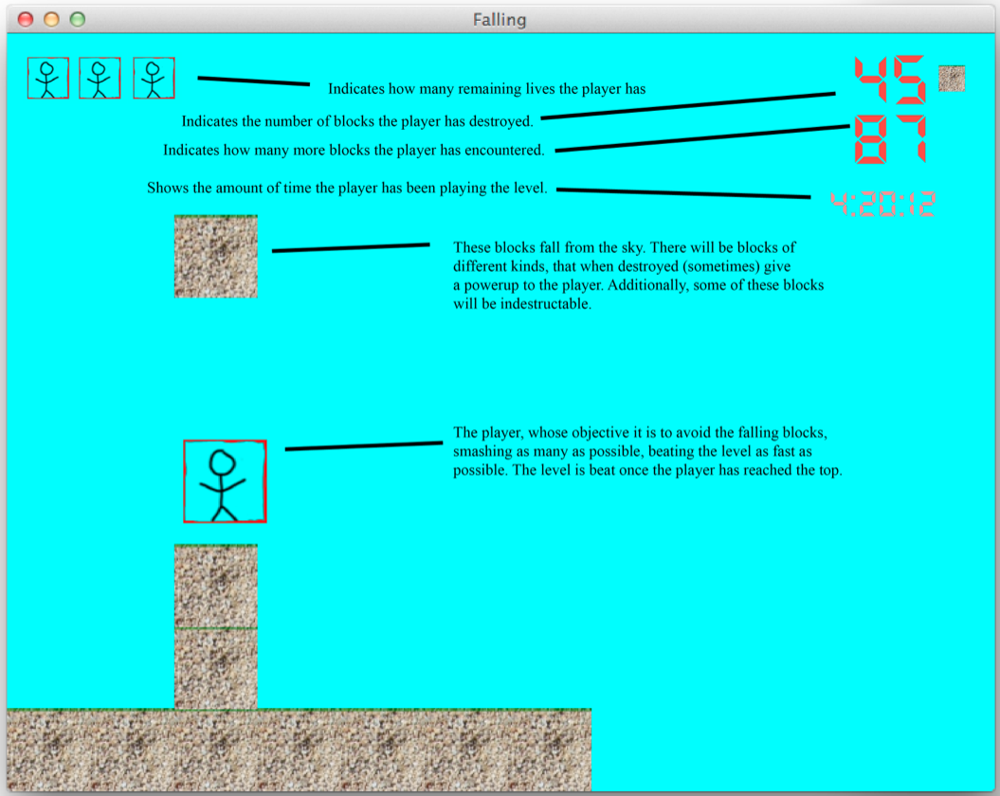

# Falling

Created by Luke Zilioli for UofM EECS Course using [zenilib](http://www.zenilib.com).

## Concept
Player controls a stick figure who is trying to avoid falling blocks, some of which can be punched to gain power-ups. Player must jump and punch to avoid blocks and reach the top of the screen.

### Video

### Game Instructions

## Description of Game
### Back Story / Goal
Falling is an arcade game where the player must avoid falling objects. This game is best classified as a survival game. As blocks pummel the ground as they fall from the sky, the player has to do everything is his power to survive the falling blocks.. He can use his iron-clad fist to punch certain blocks (which will sometimes earn him a power-up), using his agile cat-like reflexes he can dodge blocks, and combined with his ability to jump off walls, he can leap his way to safety.

As time advances, the blocks become both more frequent and more numerous, increasing the challenge for the player. The player is given a running total of the number of blocks he has encountered, the amount of time the player has survived, as well as the number of blocks the player has managed to destroy. The player’s ultimate objective is to survive. He can challenge himself and his friends to do better. The player may find himself is strange situations, where the only way to get out is with a quick eye, and an even quicker hand. Moment to moment, the player will need to make decisions regarding what he needs to do next in order to survive.

### Controls
The player has 4 primary controls: W, A, D (or the corresponding arrow keys) are used for jump, left, and right, respectively, and SPACE is used to punch blocks.

### Game Dynamics
The game gets more and more difficult as time advances. The player must keep up with the game’s ever-changing pace. The boxes respond to the player in two primary ways. The first way is by killing them. If the player has a box fall on his head, he is dead. The other way, and much more rewarding for the player is by being destroyed. If a player punches a box by hitting the SPACE bar, and the box is one that can be broken, the box will disappear, causing the above boxes to fall down. On occasion, destroying a box will reward the player with a power-up, which can be used to his/her advantage in avoiding future boxes (ex: turbo jump, fast running, stronger punch, etc.).

Although this game is primarily a survival game, which requires a quick reaction time, the player is also challenged to see how long they can survive, as well as how many boxes they can destroy. This will entice the player to play again, and again so that they can beat their previous scores.

### Extras
There are a few extras, that, time permitting, I would like to include in the game. I will list them in bullet form, keeping in mind that I probably will not get a chance to implement a lot of them.

- The ability to wall jump `( DONE )`
- A background that, as the player goes higher up, also indicates a rise in elevation (eventually reaching space)
- Super strength power-up, where the player can push blocks for a period of timev
- Cool block-spawning patterns, such as a bunch side-by-side in succession that the player must clear before its too late.
- Animations `( DONE )`
- Music `( DONE )`
- Sound Effects `( DONE )`

## Design and Implementation
In the following sections, I will discuss the various classes that are in my game, and how they interact.

### BlockHandler
This class is the driving factor behind my game. It tells each of the other objects in the game which other objects to consider for collision on each game loop. Additionally, it acts as the middleman between blocks, powerups, and the dude. It also is responsible for spawning blocks in the proper location on the screen, and respawning the dude when appropriate,.

### Score
This is a helper class used by BlockHandler to keep track of the player’s current score, as well as to display and save a list of high scores.

### GameObject
This is the base class for any object that you see within the game. For the post part, this is where decisions about collisions, etc. get made, with help from BlockHandler telling GameObject which other GameObjects to consider for collision.

### Dude
This is the class for the player. It is responsible for parsing the keyboard input and making the player behave accordingly, it is also responsible for keeping track of which powerups are currently active, as well as how many lives the player has.

### Block
Block is the class for any block displayed on the screen. Block’s only job is to move down, in hopes of killing the player. When Block gets destroyed, it tells the BlockHandler whether or not it should generate a powerup, and of what kind.

### Powerup
This class is simple. Once released from a block, Powerup shoots straight up to the top of the screen, and then falling back down. From here, Powerup waits for one of two things to happen; the dude to get it, or a block to crush it. Powerup sets its internal state accordingly so that BlockHandler can tell the other GameObjects whether a Powerup is currently active or not.

## Collision Detection
My game uses a convenient method of collision detection. For each `perform_logic()` loop, the BlockHandler passes a vector of GameObjects to each object on the screen through a `colliding()` function. This `colliding()` function loops through each GameObject in the vector, and determines weather it is colliding with the object on the top, bottom, left and right through a `colliding_with()` function, which returns a boolean array corresponding to each direction. These values are then used to update a boolean array called collisions within GameObject to determine with the object has collisions on each respective side. The `colliding()` function also populates 3 vectors full of GameObjects, bottomCollisions, leftCollisions, and rightCollisions. This way, in the `perform_logic()` function for GameObject, it has access to any objects it is currently colliding with on any of those three sides.

As each GameObject is performing its respective logic, it can easily determine if it is able to move in a given direction by accessing its colliding array with the appropriate index corresponding to top, bottom, left, and right. For example, the Dude will only perform a wall jump `if(!collisions[BOTTOM] && (collisions[LEFT] || collisions[RIGHT])`, similarly, the Dude can only attempt to punch a block `if(collisions[BOTTOM] &&(collisions[LEFT] || collisions[RIGHT]))`, as a final example, a Block will only try to move down `if(!collisions[BOTTOM])`.

# Assessment

**Is the game well designed and fun to play? This is the most important factor.**

I have found this game to be almost addicting. When I was putting the finishing touches on the game, I found myself spending more time playing it than I did enhancing it.

The game gets progressively more difficult as time goes on. Each time blocks are spawned, the time in between the current spawn and the next spawn is decreased by a small amount. Additionally, every x number of spawns, the number of blocks that are spawned per spawning is increased. So a game that starts spawning only one block at a time, will eventually be spawning 3, 4, 5 or ever more blocks at once.

There are many things that the player must think about while playing the game. Primarily, the player has to pay attention to falling blocks, avoiding them at all costs, however, the player can also punch dirt blocks, clearing more space on the ground for him to evade falling blocks. The player is encouraged to punch dirt blocks by the prospect of receiving one of the three possible power-ups. Two of the power-ups, super strength, and super jump, alter the game play for a short period of time, enabling the player to destroy stone blocks, and jump higher than usual, respectively. While either of these power-ups is active, the gameplay is slightly different. In the case of the super strength power-up, the player’s focus is shifted from avoiding blocks, to destroying as many as possible in order to clear space for easier evasion. This distraction makes it harder to focus on the falling blocks.

The BlockHandler has another distraction up its sleeve. In order to keep the block level down, and create space for future blocks, it periodically removes blocks from the bottom row, causing all of the blocks to fall down by 1. The player will randomly find himself in the air as a block falls out from under him.

These elements, combined with the player’s ability to wall jump add up to a very fun game.

**Is the game original?**

Simply put, I have never played a game like this. It is strangely reminiscent of Tetris in that blocks are falling. Through the ability to punch and destroy blocks, the player has some control over how tightly packed the blocks can get, adding another aspect to the game.

**Is the game fully functional?**

I had the time to include everything mentioned in the original design document, as well as a few extra things that I wanted to the game. The bugs in my game are either minimal, or non-existant. I have played it for hours without encountering any issues.

**Is the game nontrivial?**

The defense of this section is mostly covered in “Is the game well designed and fun to play? This is the most important factor.”.

I will just reiterate that all of the objects in the game interact in one way or another: blocks fall and land on other blocks, the dude lands on top of, slides down the side of, and can get killed by the blocks, power-ups land on top of, and can get killed by the blocks as well as get collected by the Dude. Because of its cleanup behavior, where it deletes blocks on the bottom row periodically, the BlockHandler also causes additional interactions in the game that wouldn’t otherwise be there.

## Things you might miss

Falling adjusts the number of blocks it spawns at one time depending on the size of the screen when it is launched. Because the game has varying difficulties depending on the size of the grid of blocks, and the number of blocks it is possible to have on the screen at once (dictated by the size of the game window), it shows the user a different set of high scores based on the size of the grid for that round of the game. Resize the window and start the game over for an entirely different experience and high-score set!

**Building instructions:**

http://www-personal.umich.edu/~bazald/l/setup/#gcc
http://www-personal.umich.edu/~bazald/l/build/#gcc

    ./multi-clean_sh.bat &&
    ./multi-premake_sh.bat &&
    ./multi-build_sh.bat --build=all

This will do a clean, then build the game

(cant get this to work on osx 10.10)
